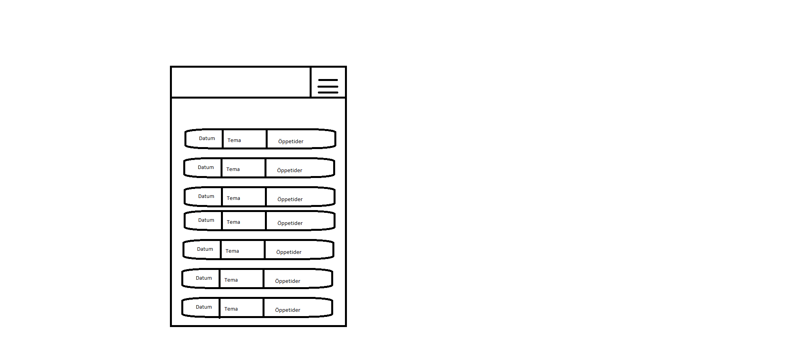

● Skiss/design-idé

Planen var att göra en enkel app med tider och teman över kårhusets verksamhet
● Webbtjänst - JSON
Datat som används är hämtat från Kårhuset boulogners facebook sida där de själv anonserar sina event.
```
"ID": "2024/01/24",
"theme": "Beerpong",
"type": "a21jonfa",
"company": "",
"occasion": "Pub",
"category": "",
"size": 0,
"cost": 0,
"times": "20:00-01:00"
```
Jag ändrade om datat lite för att passa min app bättre. Jag tog bort en del fält som jag inte behövde och la till några fält som jag behövde.
där bland annat times var auxdata innan.
Size, cost , company och category är fält som jag inte behöver för min app och är därför tomma.

● Implementationsexempel  
    * JsonReformater
``` java
public class JsonReformater {
    public static String reformat(String json) {
        json = json.replaceAll("name", "theme");
        json = json.replaceAll("location", "occasion");
        json = json.replaceAll("auxdata", "times");
        return json;
    }
}
 ```
Då de fält som fanns att använda sig av genom skolans vektyg var begränsade så valde jag att göra en egen klass för att ändra om json datan till något som passade min app bättre.

    * AboutActivityn
``` java
public boolean onCreateOptionsMenu(Menu menu) {
        MenuInflater inflater = getMenuInflater();
        inflater.inflate(R.menu.toolbar_menu, menu);
        MenuItem item = menu.findItem(R.id.item);
        item.setTitle("About");
        return true;
    }

    @Override
    public boolean onOptionsItemSelected(@NonNull MenuItem item) {
        if (item.getItemId() == R.id.item) {
            Intent intent = new Intent(this, AboutActivity.class);
            startActivity(intent);
            return true;
        }
        return super.onOptionsItemSelected(item);
    }
```
Toolbar menyn var något jag valde att implementera som sätt att ta sig till about sidan. jag täönkte inte så mycket på det eå men det var en bra övning att göra en toolbar, då den i min mening är lite annorlunda det vi gjort tidigare
    * MainActivity
``` java
● Reflektion
Jag hade en tanke om att jag ville göra en liknande app tidigare och att få möjlighetten till det gjorde det mycket roligare stt hålla på med. 
Till viss del så känner jag att ha stora komplicerade hjälp metoder ex. JsonTask tar det längre tid att förstå vad som händer och vad som behövs för att få det att fungera.
Jag tykte om det, om något så könde man hur de uppgifter som vi gjort tidigare har hjälpt mig att förstå vad som behövdes för att få det att fungera.